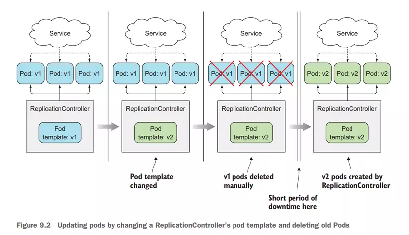
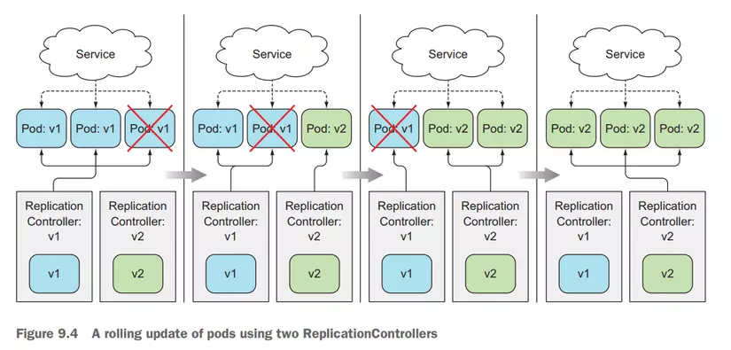

# Kubernetes Deployment

This repository contains the necessary files and instructions to deploy a Kubernetes cluster.

## Prerequisites

Before deploying Kubernetes, make sure you have the following prerequisites installed:

- Docker
- kubectl
- Minikube (for local development) or a cloud provider (for production deployment)

## Deployment Steps

To deploy Kubernetes, follow these steps:

1. Clone this repository to your local machine.
2. Navigate to the `deployment` directory.
3. Modify the configuration files according to your requirements.
4. Run the deployment script to create the cluster.
5. Verify the deployment by checking the status of the cluster and its components.
6. Start deploying your applications on the Kubernetes cluster.

## Usage

To update a container inside a Pod with a Deployment in Kubernetes, you can use the `kubectl set image` command. Here's an example:
```kubectl set image deployment <deployment-name> <container-name>=<new-image>```

Check if the update process is completed yet:
```kubectl rollout status deploy <deployment-name>```

Rollback to the previous version when the new version of the application is faulty:
```
kubectl rollout history deploy <deployment-name>
kubectl rollout undo deployment <deployment-name> --to-revision=<version>
```


## Configuration

The configuration files in this repository allow you to customize various aspects of the Kubernetes deployment, such as the number of nodes, networking, and storage options. Refer to the documentation for more details on how to configure these files.

## Troubleshooting

If you encounter any issues during the deployment process, refer to the troubleshooting section in the documentation or search for solutions in the Kubernetes community forums.

## Visualizer
| Recreate      | RollingUpdate |
| ------------- | ------------- |
|  |  |