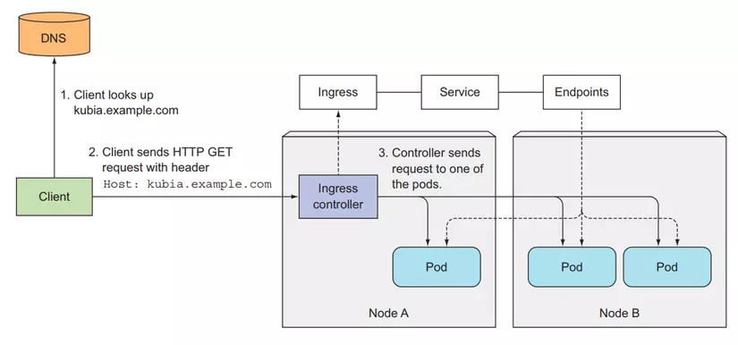

# Ingress Resource

The Ingress resource in Kubernetes is an API object that manages external access to services within a cluster. It provides a way to configure and manage HTTP and HTTPS routing rules to route traffic from outside the cluster to services running inside the cluster.

With Ingress, you can define rules to map incoming requests to specific services based on the requested host or path. This allows you to expose multiple services through a single external IP address and load balance traffic to different services based on the defined rules.

Ingress works in conjunction with an Ingress controller, which is responsible for implementing the actual routing rules and managing the external load balancer or reverse proxy. Examples of popular Ingress controllers include Nginx Ingress Controller, Traefik, and HAProxy Ingress.

To use Ingress, you need to have an Ingress controller deployed in your cluster and properly configured. Once the controller is set up, you can create Ingress resources to define the desired routing rules.

For more information on how to use and configure Ingress in Kubernetes, refer to the official Kubernetes documentation.

## Visualizer

