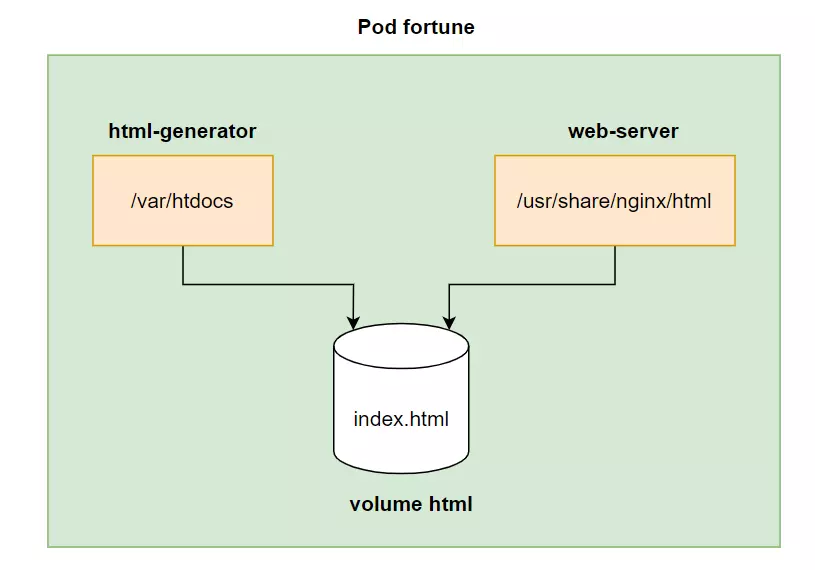
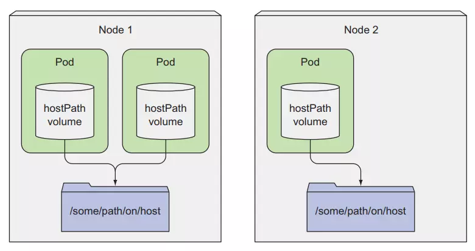
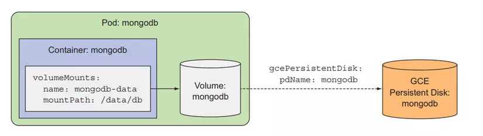
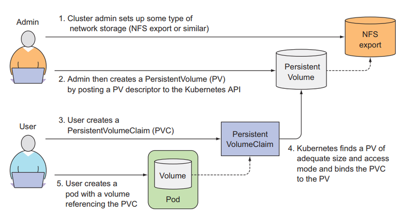
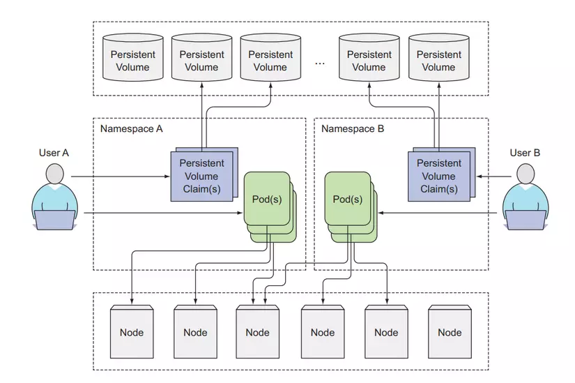
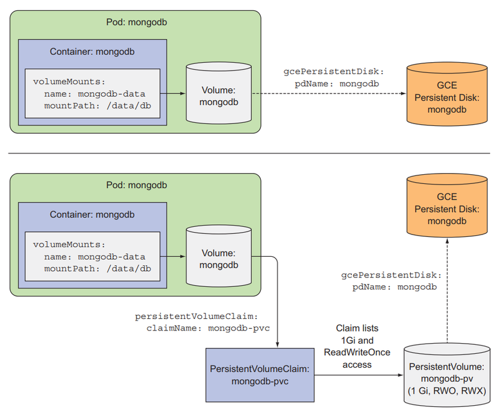

# Kubernetes Volumes

Kubernetes volumes are a way to persist data in containers. They provide a way to store and share data between containers in a pod, or between pods in a cluster. Volumes can be used to store configuration files, databases, logs, or any other type of data that needs to be preserved across container restarts.

## Types of Volumes

Kubernetes supports various types of volumes, including:

- EmptyDir: A temporary volume that is created when a pod is created and deleted when the pod is terminated.
- HostPath: A volume that mounts a file or directory from the host node's filesystem into the pod.
- PersistentVolumeClaim (PVC): A volume that is dynamically provisioned and bound to a PersistentVolume (PV) based on a user's request.
- ConfigMap: A volume that provides a way to inject configuration data into a pod.
- Secret: A volume that provides a way to inject sensitive data, such as passwords or API keys, into a pod.

## Using Volumes

To use a volume in a pod, you need to define a volume and mount it into one or more containers within the pod. You can specify the volume type, the source of the data, and the mount path within the container.

## Visualizer
| Emptydir | HostPath |
| -------- | -------- |
|  |  |

| Cloud Storage |
| ------------- |
|  |

| Assumption |
| ---------- |
|  |

| Architecture |
| ------------ |
|  |

| Workflows |
| --------- |
|  |

