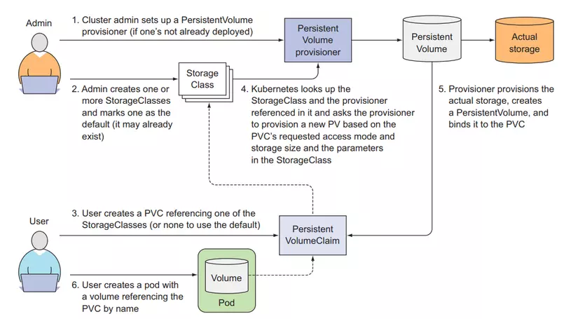

# Dynamic Provisioning of Persistent Volumes in Kubernetes

## Introduction

This README provides an overview of dynamic provisioning of persistent volumes in Kubernetes. Dynamic provisioning allows Kubernetes to automatically create and manage storage resources on-demand, simplifying the process of managing persistent volumes.

## How Dynamic Provisioning Works

Dynamic provisioning involves the use of storage classes, which define the type and properties of the storage resources to be provisioned. When a persistent volume claim (PVC) is created, Kubernetes checks the storage class specified in the claim and dynamically provisions a persistent volume (PV) that matches the requirements.

## Benefits of Dynamic Provisioning

Dynamic provisioning offers several benefits, including:

- Simplified storage management: With dynamic provisioning, administrators no longer need to manually create and manage persistent volumes. Kubernetes takes care of provisioning and managing the storage resources automatically.

- Efficient resource utilization: Dynamic provisioning ensures that storage resources are provisioned only when needed, reducing waste and optimizing resource utilization.

- Flexibility and scalability: Dynamic provisioning allows for easy scaling of storage resources as the needs of the application change. New persistent volumes can be provisioned on-demand, without requiring manual intervention.

## Getting Started

To start using dynamic provisioning in Kubernetes, follow these steps:

1. Set up a storage class that defines the properties of the storage resources to be provisioned.

2. Create a persistent volume claim (PVC) that specifies the desired storage requirements.

3. Kubernetes will automatically provision a persistent volume (PV) that matches the requirements specified in the PVC.

4. Mount the persistent volume in your application pods and start using it for storing data.

For more detailed instructions and examples, refer to the official Kubernetes documentation on dynamic provisioning.

## Conclusion

Dynamic provisioning of persistent volumes in Kubernetes simplifies the management of storage resources and provides flexibility and scalability for your applications. By leveraging dynamic provisioning, you can ensure efficient resource utilization and streamline the process of managing persistent volumes.

## Visualizer
